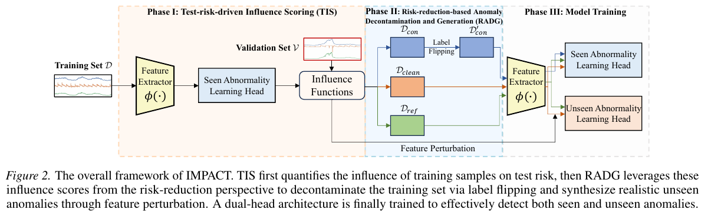

<div align="center">
  <h2>IMPACT: Influence Modeling for Open-Set Time Series Anomaly Detection</b></h2>
</div>


Official implementation of ICML'26 paper <a href="https://arxiv.org/abs/2603.29183">"IMPACT: Influence Modeling for Open-Set Time Series Anomaly Detection"</a>

## Introduction

> This work proposes IMPACT, a novel framework to leverage influence modeling for open-set TSAD, simultaneously addressing the dual challenges of anomaly contamination and generation in time series data. IMPACT comprises two key modules: 1) Test-risk-driven Influence Scoring (TIS), which performs a multi-channel deviation loss-based influence modeling to precisely quantify the effect of each training sample on the model's test risk; and 2) Risk-reduction-based Anomaly Decontamination and Generation (RADG), which leverages the resulting influence scores to generate semantically divergent yet realistic unseen anomalies for time series while repurposing high-influential samples as supervised anomalies for anomaly decontamination.

<p align="center">
    
</p>

## Installation

Install Pytorch 1.10.0+cu113 with Python 3.8, and then install the dependencies:

```setup
pip install -r requirements.txt
```

## Run Experiments

- Run IMPACT on **CT** with default parameters under the general setting:

  ```python
  python3 main.py --data SAD --setting general
  ```

## Citation

Please consider citing our paper if you find this repository useful.

X. Zhou, Y. Wang, H. Xu, W. Liang, X. Li, G. Pang, "IMPACT: Influence Modeling for Open-Set Time Series Anomaly Detection" in ICML. 2026.

```
@inproceedings{zhou2026impact,
  title={IMPACT: Influence Modeling for Open-Set Time Series Anomaly Detection},
  author={Zhou, Xiaohui and Wang, Yijie and Xu, Hongzuo and Liang, Weixuan and Li, Xiaoli and Pang, Guansong},
  booktitle={International Conference on Machine Learning},   
  year={2026}
}
```
